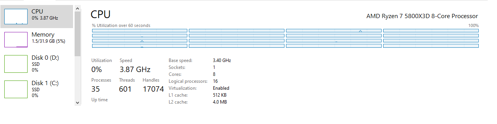

# Gaming OS Tweaker

> Attempts to debloat, keep low input lag, low latency, better hitreg and improved performance.

```txt
I am not responsible for any damage the scripts could cause.

Make sure you create a System Restore Point before running any scripts.
```

> Know that if you execute all the scripts, it will make your OS for games only, that is the focus. Dont expect to be usable for your everyday everything.

> It will NOT leave your OS secure, because it remove and disable a lot of features in favor of performance. You need your good sense and just play games safely, like the ones installed by clients, e.g., steam, battle.net, etc.. I also left some security options in `scripts/optional_helpers/install_apps.cmd`

---

### How to

> If you need to download a fresh OS ISO directly from Microsoft, follow the guide at [WINDOWS_DOWNLOAD_GUIDE](/docs/WINDOWS_DOWNLOAD_GUIDE.md)

- Create a system restore point.
- Run scripts from `scripts/debloat` folder first, and `scripts/tweaks` after.
- I recommend to at least also run the `install_apps.cmd` from `scripts/optional_helpers/` folder.
- **For every `.cmd` script you run, run as administrator.**
- Reboot and Done!

> After running the scripts, follow some guides from the `docs` folder.

- [GPU_GUIDE](/docs/GPU_GUIDE.md)
- [OTHERS_GUIDE](/docs/OTHERS_GUIDE.md)
- [AUDIO_GUIDE](/docs/AUDIO_GUIDE.md)
- [CPU_GUIDE](/docs/CPU_GUIDE.md)
- [PERIPHERALS_GUIDE](/docs/PERIPHERALS_GUIDE.md)

---

### Result

From a fresh Windows 10 22H2 install and completely updated, and applying the scripts from this repo, it was reduced to `32` processes, with Nvidia Driver (debloated) in the background and Task Manager.

No additional tools were used.

It's a very clean OS, while being decently functional. Task scheduler, UAC and Firewall are kept enabled. Windows Update are disabled due to not being able to complete installation.

In my 5800X3D, the average DPC Latency are at `0.7`. Maybe with a high-end Intel that would be even less. Though latest nvidia drivers are having high dpc issues, and they have recognized and are working on it, when they fix, maybe even with Ryzen will be less in the average. With the CPU idle state disabled, it was able to go to `0.5`, but the average fps in Overwatch 2 for example were less than when enabled.

Good reference:  <https://docs.google.com/document/d/1ILugrwtHfmisYzI1MdCOhSzBPuLJPi5D7xYJgQ4sxDM/edit#heading=h.mjyvqzxoctd0>

To give some perspective on the FPS, before I was on Win11 only with some tweaks and debloat changes. I had to use the nvidia driver optimized for Overwatch 2 to be able to keep consistent 420fps at 1440p with pretty much no dips, but were not possible with other driver versions. Now in Win10 with the scripts from this repo, it never goes below 500fps, stays on 600fps when there is no fights and 540fps~ in mid fights most of the time, and I am using the latest driver from nvidia, not the optimized for Overwatch 2.



---

### Why did I built this compilation of scripts?

Mostly, because I wanted a clean OS, with all the optimizations and I didnt trust the modified gaming OS out there. And It didnt feel that the other scripts out there were complete or clean enough.

I dont take credit for the scripts, since I got parts of it from many different places. I didnt kept all the urls and I didnt wanted to give credit to some only, so end up not giving to anyone.

People keep making big youtube videos or articles for very small chunks or single tweak(s), repeating the same thing, good ones are the minority. Some may even charge for this kind of tweaking. Here you may get all or almost all of it.

> If you have any suggestions, additions or corrections, feel free to create an issue and/or PR.

---

### Why I don't trust gaming modified windows OS?

Simply because as much as people tried to make it transparent by even putting it on github, some don't even do it, they just create a repo saying it's open-source.

Main point is, there is no way to know how the image (ISO) are being built, it's not transparent there, whoever is responsible could use the opportunity to hide a rootkit in this part of the process, and no one would know, while keeping the argument that it was all open source. So, that's why.

Rootkit means one could implement any sort of malicious code, like a spyware or any other type, as root (has access to everything, much more than is visible to users), and by doing that, in a modified OS preinstall, all security measures that would have been in place, could be bypassed, therefore allowing the malicious code to be executed and also be kept undetected.

I dont know about the legallity of distributing modified Windows OS.

It doesnt mean they arent trustworthy, I don't know them, it just means it's not transparent enough as it is.

<https://www.reddit.com/r/Windows10/comments/w54ign/am_i_out_of_my_mind_or_just_paranoid_ntlite_msmg/>

---

### Anti-Cheats

- Defense Matrix (Overwatch 2) - Working
- Easy Anti-Cheat (Fortnite, Apex Legends) - Working
- Ricochet (Call of Duty) - Working
- BattleEye (Escape from Tarkov, Destiny 2) - Working
- Punkbuster (BF4) - Working
- Vanguard (Valorant) - Working **(But, only if you apply the `anticheat_fix.cmd` from `scripts/optional_helpers/` folder, to enable the exploit mitigations again.)**
- FaceIT (CSGO) - Not Tested **(It seems that might be similar to Vanguard in terms of requirements. I dont play the game to know.)**

> I didnt have the opportunity to test every game, but most without Anti-Cheats should be working, except maybe VR/Mixed Reality. If anyone find any issue, feel free to create an issue and/or PR.

---

### Other

- Scheduling Priorities seem to have hard locks done by the OS, there is a way to undo those, but the tool recommended has a lot of red flags related to trojan. Maybe if built manually it would be worth using.
  - <https://www.youtube.com/watch?v=-jYnDuK-vB0>
  - <https://learn.microsoft.com/en-us/windows/win32/procthread/scheduling-priorities>
  - <https://github.com/katlogic/WindowsD>
- Could help improve security script
  - <https://github.com/atlantsecurity/windows-hardening-scripts>
  - <https://github.com/HotCakeX/Harden-Windows-Security>

- Tools that could be useful
  - <https://msfn.org/board/topic/152688-win6x_registry_tweak/> - To remove apps not possible with powershell / regular scripting
  - <https://github.com/riverar/mach2>
  - <https://github.com/M2Team/NanaRun>
  - <https://www.zeus-software.com/downloads/ntfsaccess>
  - <https://github.com/Chuyu-Team/Dism-Multi-language>
  - <https://github.com/he3als/setSvc>
  - <https://www.snappy-driver-installer.org>
  - <https://github.com/dlwyatt/PolicyFileEditor>
  - <https://hexed.it/>
  - <https://systeminformer.sourceforge.io/>
  - <https://github.com/thebookisclosed/ViVe>
