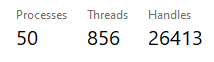

# Gaming OS Tweaker

> Attempts to keep low input lag, low latency and improved performance.

```txt
I dont take responsability for any damage the scripts could cause.
Make sure you create a System Restore Point before running any scripts.
```

## How to

> If you need to download a fresh OS ISO directly from Microsoft, follow the guide at [WINDOWS_DOWNLOAD_GUIDE](/docs/WINDOWS_DOWNLOAD_GUIDE.md)

- Create a system restore point
- If you want apps instalation to be automated, install winget manually <https://github.com/microsoft/winget-cli/releases/> In Assets, Download `.msixbundle` and install it. You can improve the `apps/install.cmd` for yourself.
- In some scripts from `scripts/tweaks` folder, you might need to fill it up manually. All should be on top of each script. It should be `gpu.cmd`, `network.cmd` and `power.cmd`
- Run scripts from `scripts/debloat` folder first
- Run every script as administrator

> After running the scripts, follow some guides in `docs` folder. [GPU_DRIVER_GUIDE](/docs/GPU_DRIVER_GUIDE.md) and [OTHERS_GUIDE](/docs/OTHERS_GUIDE.md)

### Notes

- `scripts/apps` are optional helpers
- `scripts/additional_files` contain files like configurations

---

From a fresh Windows 10 22H2 install and completely updated, it was able to keep 50 processes while running Process Lasso, MSI Afterburner, ISLC, vibrantGUI, and with Nvidia Driver, after debloat and tweaks were done. No additional tools were used.



It's a very clean OS, while being functional and being able to make windows update. You can reapply the scripts after a windows update.

---

Why did I built this compilation of scripts?

Mostly, because I wanted a clean OS, with all the optimizations and I didnt trust the modified gaming OS out there. And It didnt feel that the other scripts out there were complete or clean enough.

I dont take credit for the scripts, since I got parts of it from many different places. I didnt kept all the urls and I didnt wanted to give credit to some only, so end up not giving to anyone.

---

Why I didnt trust gaming modified windows OS?

Simply because as much as people tried to make it transparent by even putting it on github. There was no way to know how the image (ISO) was being built, it was not transparent there, and anyone could use the opportunity to hide a rootkit in this part of the process, and no one would know, while keeping the argument that it was all open source. So, that's why. It doesnt mean they arent trustworthy, just means it's not transparent enough as it is.

<https://www.reddit.com/r/Windows10/comments/w54ign/am_i_out_of_my_mind_or_just_paranoid_ntlite_msmg/>

---

> I didnt have the opportunity to test every game. But if anyone find any issue, feel free to create an issue and/or PR.

> If you have any suggestions, additions or correction, feel free to create an issue and/or PR.

---

Other:

- An option, would be to remove services <https://learn.microsoft.com/en-us/dotnet/framework/windows-services/how-to-install-and-uninstall-services>
